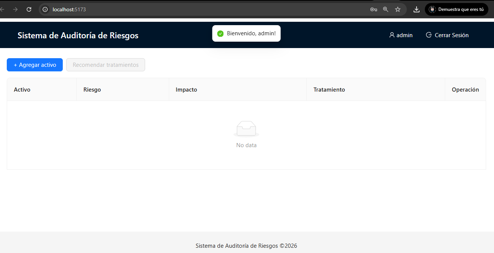
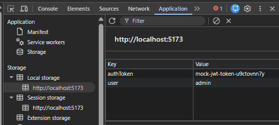
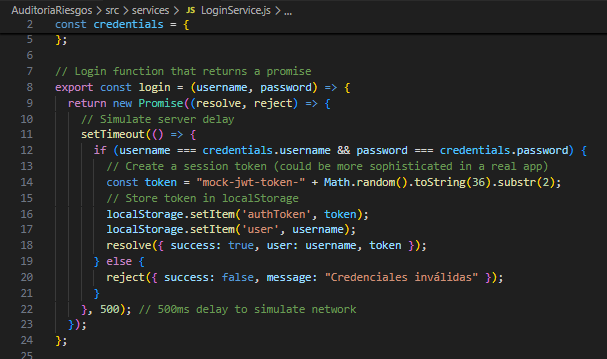

# Informe de Auditoría de Sistemas - Examen de la Unidad I

**Nombres y apellidos:** Jaime Elias Flores Quispe
**Fecha:** 22 de abril de 2026
**URL GitHub:** [Inserta aquí el enlace a tu repositorio]

1. Proyecto de Auditoría de Riesgos

**Login**

Evidencia:


*Captura: pantalla del formulario. Archivo: `evidencia/login_success.png` — Fecha: 22/04/2026.*



*Captura: pantalla tras inicio de sesión exitoso (usuario visible). Archivo: `evidencia/login_success.png` — Fecha: 22/04/2026.*


*Captura: intento de login fallido mostrando mensaje de error. Archivo: `evidencia/login_error.png`.*



*Captura: DevTools → Application mostrando `localStorage`/`sessionStorage` (valores sensibles redactados). Archivo: `evidencia/login_storage.png`.*



*Captura: fragmento de `src/components/Login.jsx` y `src/services/LoginService.js` donde se valida y guarda el token. Archivo: `evidencia/login_codigo.png`.*

Descripción: El sistema incluye un login ficticio sin base de datos implementado en `src/components/Login.jsx` y `src/services/LoginService.js` con credenciales demo (`admin` / `123456`) y almacenamiento de token en `localStorage`.

**Motor de Inteligencia Artificial**

Evidencia:


*Captura: fragmento de `app.py` con `obtener_riesgos` y `obtener_tratamiento` mostrando prompts y manejo de fallback. Archivo: `evidencia/ia_codigo.png`.*


*Captura: DevTools → Network o salida de `curl`/PowerShell mostrando la petición POST a `/analizar-riesgos` y la respuesta JSON (valores sensibles redactados). Archivo: `evidencia/ia_network.png`.*


*Captura: pantalla de la interfaz mostrando riesgos/impactos generados por la IA para un activo. Archivo: `evidencia/ia_resultado.png`.*


*Captura: terminal mostrando Flask y/o Ollama en ejecución. Archivo: `evidencia/backend_running.png`.*

Descripción: (Breve explicación de la sección de código mejorado que hace posible el funcionamiento de la IA en el sistema). El backend en `app.py` utiliza Ollama vía cliente local. Se añadió manejo de errores y fallback estático cuando el modelo local no responde. Las funciones principales son `obtener_riesgos(activo)` y `obtener_tratamiento(riesgo)`.

2. Hallazgos

Activo 1: Base de Datos Clientes
Evidencia:


*Captura: panel de administración / configuración de accesos y backups. Archivo: `evidencia/activo1_bd_clientes.png`.*
Condición: Acceso con privilegios no segmentados; faltan copias de seguridad cifradas fuera de sitio.
Recomendación: Implementar cifrado en reposo, control de accesos basado en roles y backups automatizados fuera de la red principal.
Riesgo: Probabilidad Alta

Activo 2: API Transacciones
Evidencia:


*Captura: petición en DevTools / logs mostrando headers y payload. Archivo: `evidencia/activo2_api_transacciones.png`.*
Condición: No se valida firmemente la entrada; falta rate-limiting y logging estructurado.
Recomendación: Añadir validación de entradas, autenticación fuerte, rate-limiting y monitoreo con SIEM.
Riesgo: Probabilidad Media

Activo 3: Aplicación Web de Banca
Evidencia:


*Captura: flujo de autenticación y cookies/CSP en DevTools. Archivo: `evidencia/activo3_app_web.png`.*
Condición: Sesiones prolongadas sin expiración automática; posibilidad de CSRF/ XSS si no se aplican cabeceras adecuadas.
Recomendación: Implementar control de sesión, cabeceras de seguridad (CSP, X-Frame-Options), y pruebas de vulnerabilidades web regulares.
Riesgo: Probabilidad Media

Activo 4: Backup en NAS
Evidencia:


*Captura: ubicación y estado de cifrado de backups; script/configuración si aplica. Archivo: `evidencia/activo4_backup_nas.png`.*
Condición: Backups locales sin cifrado y sin verificación periódica de integridad.
Recomendación: Cifrar backups, almacenar copias fuera de sitio y realizar pruebas periódicas de restauración.
Riesgo: Probabilidad Alta

Activo 5: Firewall Perimetral
Evidencia:


*Captura: reglas o logs de firewall mostrando reglas permisivas o eventos recientes. Archivo: `evidencia/activo5_firewall.png`.*
Condición: Reglas de firewall demasiado permisivas y falta de segmentación por zonas.
Recomendación: Revisar políticas, aplicar principio de menor privilegio, y monitorizar logs de firewall.
Riesgo: Probabilidad Media

Anexo 1: Activos de información
[Ver Anexo completo en el enunciado del ejercicio]

Anexo 2: Rúbrica de Evaluación
La nota final es la suma de todos los criterios (máx. 20 puntos).

Criterio 0 pts 5 pts
Puntaje
Máximo
Login
No presenta evidencia o está
incorrecto
Login ficticio completo, funcional y
con evidencia clara
5
IA
Funcionando
No presenta IA o está incorrecta
IA implementada, funcionando y
con evidencia clara
5
Evaluación de
5 Activos
Menos de 5 activos evaluados o
sin hallazgos válidos
5 activos evaluados con hallazgos
claros y evidencias
5
Informe claro y
completo
Informe ausente, incompleto o
poco entendible
Informe bien estructurado y
completo según lo requerido
5

---

Instrucciones para exportar este README a PDF:

- En Windows: abrir el README en su navegador o en VSCode y usar "Print" → "Guardar como PDF".
- Alternativamente usar `pandoc` o `wkhtmltopdf` para generar PDF desde Markdown.

Comandos rápidos:
```bash
# Con pandoc (requiere instalación)
pandoc README.md -o Informe_Auditoria.pdf --from markdown --pdf-engine=wkhtmltopdf
```

Subir `Informe_Auditoria.pdf` al aula virtual junto con la URL del repositorio GitHub.
